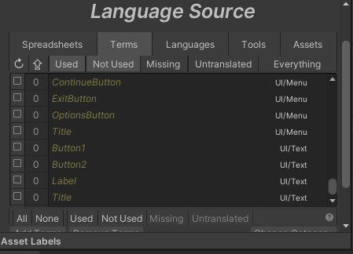
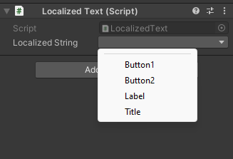
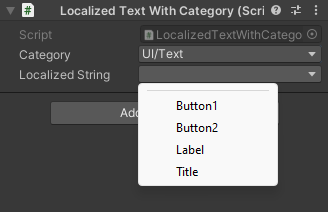
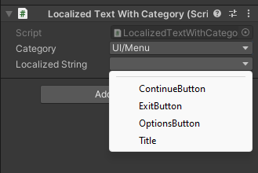

# I2LocalizationModifications

This repository contains custom modifications and utilities for the [I2 Localization plugin](https://assetstore.unity.com/packages/tools/localization/i2-localization-14884) in Unity. It provides attributes and property drawers for easier selection and management of localization terms and categories within the Unity editor.

## Features

- **LocalizationPathAttribute**: An attribute for specifying a localization path.
- **LocalizationCategoryAttribute**: An attribute for specifying a localization category.

## Installation

1. Install [I2 Localization plugin](https://assetstore.unity.com/packages/tools/localization/i2-localization-14884)
2. Clone or download this repository.
3. Add the files to your Unity project.

## Usage

### LocalizationPathAttribute

Use the `LocalizationPathAttribute` to specify a localization path for a property.

```csharp
using I2.Loc;
using UnityEngine;

public class LocalizedText : MonoBehaviour
{
    [LocalizationPath("UI/Text")]
    public LocalizedString localizedString;
}
```
My Terms looks like this:



So my options are:



### LocalizationCategoryAttribute

Use the `LocalizationCategoryAttribute` to specify a localization category for a property.


```csharp
using I2.Loc;
using UnityEngine;

public class LocalizedTextWithCategory : MonoBehaviour
{
    [LocalizationCategory("UI")]
    public LocalizedCategory category;
    [LocalizationPath("$category")]
    public I2.Loc.LocalizedString localizedString;
    
}
```

As result it shows only the terms from the specified category:





### Extra

You can also use both attributes with a string or reference to parameter/method to specify a path directly.
